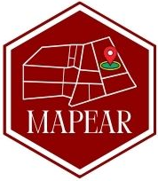

  
  
```{r setup, include=FALSE}
library(knitr)
library(rmdformats)

## Global options
knitr::opts_chunk$set(
	echo = FALSE,
	message = FALSE,
	warning = FALSE,
	comment = NA
)
```

```{r, echo=FALSE}

```
```{r}
# pacotes
library(leaflet)
library(dplyr)
```

<!--# seção-->
# BLOCO A

  
<!--# Sub-seção-->
## Térreo
  

<!--# Sub-seção-->
### Laboratório de Panificação &#127838;
  
<!--# mapa-->
```{r}
# Initialize and assign m as the leaflet object
utf <- leaflet() %>%
  # Now add tiles to it
  addTiles() %>%  
  # Setting the middle of where the map should be and the zoom level
  setView(lng=-51.114540, lat=-23.3075632, zoom = 40) %>%
  # Now, add a marker with a popup, 
  addMarkers(lng=-51.114540, lat=-23.3075632, 
             popup="<b>Laboratório de Panificação</b>
             <br><a href='fotos-A/terreo/lab_panif.jpg'>-lab001</a>")

utf 
```

  

### Laboratório de Bebidas e Vegetais &#129380;

```{r}
# Initialize and assign m as the leaflet object
utf <- leaflet() %>%
  # Now add tiles to it
  addTiles() %>%  
  # Setting the middle of where the map should be and the zoom level
  setView(lng=-51.114540, lat=-23.3075632, zoom = 40) %>%
  # Now, add a marker with a popup, 
  addMarkers(lng=-51.114540, lat=-23.3075632, 
             popup="<b>Laboratório de Bebidas e Vegetais</b>
             <br><a href='fotos-A/terreo/lab_bebidas_vegetais.jpg'>-lab002</a>")

utf 
```
  
### Laboratório de Laticíneos &#129472;
  


<!--# mapa-->
```{r}
# Initialize and assign m as the leaflet object
utf <- leaflet() %>%
  # Now add tiles to it
  addTiles() %>%  
  # Setting the middle of where the map should be and the zoom level
  setView(lng=-51.114540, lat=-23.3075632, zoom = 40) %>%
  # Now, add a marker with a popup, 
  addMarkers(lng=-51.114540, lat=-23.3075632, 
             popup="<b>Laboratório de Laticíneos</b>
             <br><b>dldldldldl &#129371;</b><br><a href='fotos-A/terreo/lab_lat.jpg'>-lab003</a><br><a href='http://www.utfpr.edu.br/'>-UTFPR</a>")

utf 
```


### Laboratório de Carnes &#129385;

```{r}
# Initialize and assign m as the leaflet object
utf <- leaflet() %>%
  # Now add tiles to it
  addTiles() %>%  
  # Setting the middle of where the map should be and the zoom level
  setView(lng=-51.114540, lat=-23.3075632, zoom = 40) %>%
  # Now, add a marker with a popup, 
  addMarkers(lng=-51.114540, lat=-23.3075632, 
             popup="<b>Laboratório de Carnes</b>
             <br><a href='fotos-A/terreo/lab_carnes.jpg'>-lab004</a>")

utf 
```


## 1°andar

### DIRPPG

- Diretoria de pesquisa e pós-graduação
  Número: (43) 3376-9261
  Email: dirppg-ld@utfpr.edu.br
  Horário de atendimento: Segunda à sexta das 08h00 às 12h30 e das 13h30 às 17h00

```{r}
# Initialize and assign m as the leaflet object
utf <- leaflet() %>%
  # Now add tiles to it
  addTiles() %>%  
  # Setting the middle of where the map should be and the zoom level
  setView(lng=-51.114540, lat=-23.3075632, zoom = 40) %>%
  # Now, add a marker with a popup, 
  addMarkers(lng=-51.114540, lat=-23.3075632, 
             popup="<b>DIRPPG</b>
             <br><a href='fotos-A/primeiro/dirppg.jpg'>-Sala101</a>")

utf 
```

### Salas de aula

-Salas número-102,103,104,105,106.

```{r}
# Initialize and assign m as the leaflet object
utf <- leaflet() %>%
  # Now add tiles to it
  addTiles() %>%  
  # Setting the middle of where the map should be and the zoom level
  setView(lng=-51.114540, lat=-23.3075632, zoom = 40) %>%
  # Now, add a marker with a popup, 
  addMarkers(lng=-51.114540, lat=-23.3075632, 
             popup="<b>Salas</b>
             <br><a href='fotos-A/primeiro/salas_aula.jpg'>-Salas</a>")

utf 
```


## 2°andar

### PPGTAL
-Programa de Pós-graduação em Tecnologia de Alimentos

```{r}
# Initialize and assign m as the leaflet object
utf <- leaflet() %>%
  # Now add tiles to it
  addTiles() %>%  
  # Setting the middle of where the map should be and the zoom level
  setView(lng=-51.114540, lat=-23.3075632, zoom = 40) %>%
  # Now, add a marker with a popup, 
  addMarkers(lng=-51.114540, lat=-23.3075632, 
             popup="<b>PPGATL</b>
             <br><a href='fotos-A/segundo/PPGTAL.jpg'>-Sala201</a>")

utf 
```


### Data center


```{r}
# Initialize and assign m as the leaflet object
utf <- leaflet() %>%
  # Now add tiles to it
  addTiles() %>%  
  # Setting the middle of where the map should be and the zoom level
  setView(lng=-51.114540, lat=-23.3075632, zoom = 40) %>%
  # Now, add a marker with a popup, 
  addMarkers(lng=-51.114540, lat=-23.3075632, 
             popup="<b>Data center</b>
             <br><a href='fotos-A/segundo/Data Center.jpg'>-Sala202</a>")

utf 
```

### COGETI
-Cordenação de Gestão de Tecnologia de Informação
 Número: 43 3315-6115
```{r}
# Initialize and assign m as the leaflet object
utf <- leaflet() %>%
  # Now add tiles to it
  addTiles() %>%  
  # Setting the middle of where the map should be and the zoom level
  setView(lng=-51.114540, lat=-23.3075632, zoom = 40) %>%
  # Now, add a marker with a popup, 
  addMarkers(lng=-51.114540, lat=-23.3075632, 
             popup="<b>COGETI</b>
             <br><a href='fotos-A/segundo/COGETI.jpg'>-Sala203</a>")

utf 
```


### COGERH

-Cordenadoria de Gestão de Recursos Humanos 
 Número:(43) 3376-9281
 Horário:Segunda à sexta 08h00 às 11h00 e das 13h00 às 17h00

```{r}
# Initialize and assign m as the leaflet object
utf <- leaflet() %>%
  # Now add tiles to it
  addTiles() %>%  
  # Setting the middle of where the map should be and the zoom level
  setView(lng=-51.114540, lat=-23.3075632, zoom = 40) %>%
  # Now, add a marker with a popup, 
  addMarkers(lng=-51.114540, lat=-23.3075632, 
             popup="<b>COGERH</b>
             <br><a href='fotos-A/segundo/COGERH.jpg'>-Sala204</a>")

utf 
```

### FUNTEF

```{r}
# Initialize and assign m as the leaflet object
utf <- leaflet() %>%
  # Now add tiles to it
  addTiles() %>%  
  # Setting the middle of where the map should be and the zoom level
  setView(lng=-51.114540, lat=-23.3075632, zoom = 40) %>%
  # Now, add a marker with a popup, 
  addMarkers(lng=-51.114540, lat=-23.3075632, 
             popup="<b>FUNTEF</b>
             <br><a href='fotos-A/segundo/FUNTEF.jpg'>-Sala205</a>")

utf 
```


### DIRPLAD, DEMAP, DEOFI e DEPRO
  Email: deofi-ld@utfpr.edu.br


```{r}
# Initialize and assign m as the leaflet object
utf <- leaflet() %>%
  # Now add tiles to it
  addTiles() %>%  
  # Setting the middle of where the map should be and the zoom level
  setView(lng=-51.114540, lat=-23.3075632, zoom = 40) %>%
  # Now, add a marker with a popup, 
  addMarkers(lng=-51.114540, lat=-23.3075632, 
             popup="<b>DIRPLAD, DEMAP, DEOFI e DEPRO</b>
             <br><a href='fotos-A/segundo/DIRPLAD_DEMAP_DEOFI_DEPRO.jpg'>-Sala 206</a>")

utf 
```


### DESEG


```{r}
# Initialize and assign m as the leaflet object
utf <- leaflet() %>%
  # Now add tiles to it
  addTiles() %>%  
  # Setting the middle of where the map should be and the zoom level
  setView(lng=-51.114540, lat=-23.3075632, zoom = 40) %>%
  # Now, add a marker with a popup, 
  addMarkers(lng=-51.114540, lat=-23.3075632, 
             popup="<b>DESEG</b>
             <br><a href='fotos-A/segundo/DESEG.jpg'>-Sala207</a>")

utf 
```


### Sala de reuniões


```{r}
# Initialize and assign m as the leaflet object
utf <- leaflet() %>%
  # Now add tiles to it
  addTiles() %>%  
  # Setting the middle of where the map should be and the zoom level
  setView(lng=-51.114540, lat=-23.3075632, zoom = 40) %>%
  # Now, add a marker with a popup, 
  addMarkers(lng=-51.114540, lat=-23.3075632, 
             popup="<b>Sala de reuniões</b>
             <br><a href='fotos-A/segundo/Sala_reunioes.jpg'>-Sala208</a>")

utf 
```


### GADIR e DIRGE

-Gadir: Gabinete de Diretoria-Geral
```{r}
# Initialize and assign m as the leaflet object
utf <- leaflet() %>%
  # Now add tiles to it
  addTiles() %>%  
  # Setting the middle of where the map should be and the zoom level
  setView(lng=-51.114540, lat=-23.3075632, zoom = 40) %>%
  # Now, add a marker with a popup, 
  addMarkers(lng=-51.114540, lat=-23.3075632, 
             popup="<b>GADIR e DIRGE</b>
             <br><a href='fotos-A/segundo/GADIR_DIRGE.jpg'>-Sala209</a>")

utf 
```


### Fragmentadora de papel


```{r}
# Initialize and assign m as the leaflet object
utf <- leaflet() %>%
  # Now add tiles to it
  addTiles() %>%  
  # Setting the middle of where the map should be and the zoom level
  setView(lng=-51.114540, lat=-23.3075632, zoom = 40) %>%
  # Now, add a marker with a popup, 
  addMarkers(lng=-51.114540, lat=-23.3075632, 
             popup="<b>Fragmentadora de papel</b>
             <br><a href='fotos-A/segundo/frag-papel.jpg'>-Sala210</a>")

utf 
```


## 3° andar

### Sala de apoio

```{r}
# Initialize and assign m as the leaflet object
utf <- leaflet() %>%
  # Now add tiles to it
  addTiles() %>%  
  # Setting the middle of where the map should be and the zoom level
  setView(lng=-51.114540, lat=-23.3075632, zoom = 40) %>%
  # Now, add a marker with a popup, 
  addMarkers(lng=-51.114540, lat=-23.3075632, 
             popup="<b>Sala de apoio</b>
             <br><a href='fotos-A/terceiro/sala_apoio_a301.jpg'>-Sala301</a>")

utf 
```


### Laboratório de análise sesorial
 
```{r}
# Initialize and assign m as the leaflet object
utf <- leaflet() %>%
  # Now add tiles to it
  addTiles() %>%  
  # Setting the middle of where the map should be and the zoom level
  setView(lng=-51.114540, lat=-23.3075632, zoom = 40) %>%
  # Now, add a marker with a popup, 
  addMarkers(lng=-51.114540, lat=-23.3075632, 
             popup="<b>Laboratório de análise sensorial</b>
             <br><a href='fotos-A/terceiro/lab_analise_sensorial.jpg'>-Sala302</a>")

utf 
```

### Laboratório de Análise de Alimentos

```{r}
# Initialize and assign m as the leaflet object
utf <- leaflet() %>%
  # Now add tiles to it
  addTiles() %>%  
  # Setting the middle of where the map should be and the zoom level
  setView(lng=-51.114540, lat=-23.3075632, zoom = 40) %>%
  # Now, add a marker with a popup, 
  addMarkers(lng=-51.114540, lat=-23.3075632, 
             popup="<b>Laboratório de Análise de Alimentos</b>
             <br><a href='fotos-A/terceiro/lab_ana_ali.jpg'>-Sala303</a>")

utf 
```


### Laboratório de metódos intrumentais

```{r}
# Initialize and assign m as the leaflet object
utf <- leaflet() %>%
  # Now add tiles to it
  addTiles() %>%  
  # Setting the middle of where the map should be and the zoom level
  setView(lng=-51.114540, lat=-23.3075632, zoom = 40) %>%
  # Now, add a marker with a popup, 
  addMarkers(lng=-51.114540, lat=-23.3075632, 
             popup="<b>Laboratório de métodos instrumentais</b>
             <br><a href='fotos-A/terceiro/lab_met_instrumentais.jpg'>-Sala304</a>")

utf 
```


### Laboratório de microbiologia

```{r}
# Initialize and assign m as the leaflet object
utf <- leaflet() %>%
  # Now add tiles to it
  addTiles() %>%  
  # Setting the middle of where the map should be and the zoom level
  setView(lng=-51.114540, lat=-23.3075632, zoom = 40) %>%
  # Now, add a marker with a popup, 
  addMarkers(lng=-51.114540, lat=-23.3075632, 
             popup="<b>Laboratório de microbiologia</b>
             <br><a href='fotos-A/terceiro/lab_microbiologia.jpg'>-Sala305</a>")

utf 
```


### Laboratório de bioquimica

```{r}
# Initialize and assign m as the leaflet object
utf <- leaflet() %>%
  # Now add tiles to it
  addTiles() %>%  
  # Setting the middle of where the map should be and the zoom level
  setView(lng=-51.114540, lat=-23.3075632, zoom = 40) %>%
  # Now, add a marker with a popup, 
  addMarkers(lng=-51.114540, lat=-23.3075632, 
             popup="<b>Laboratório de bioquimica</b>
             <br><a href='fotos-A/terceiro/lab_biioquimica.jpg'>-Sala306</a>")

utf 
```

### Sala de Apoio

```{r}
# Initialize and assign m as the leaflet object
utf <- leaflet() %>%
  # Now add tiles to it
  addTiles() %>%  
  # Setting the middle of where the map should be and the zoom level
  setView(lng=-51.114540, lat=-23.3075632, zoom = 40) %>%
  # Now, add a marker with a popup, 
  addMarkers(lng=-51.114540, lat=-23.3075632, 
             popup="<b>Sala de Apoio</b>
             <br><a href='fotos-A/terceiro/apoio_07.jpg'>-Sala307</a>")

utf 
```

### Laboratório de biologia e ecologia


```{r}
# Initialize and assign m as the leaflet object
utf <- leaflet() %>%
  # Now add tiles to it
  addTiles() %>%  
  # Setting the middle of where the map should be and the zoom level
  setView(lng=-51.114540, lat=-23.3075632, zoom = 40) %>%
  # Now, add a marker with a popup, 
  addMarkers(lng=-51.114540, lat=-23.3075632, 
             popup="<b>Laboratório de biologia e ecologia</b>
             <br><a href='fotos-A/terceiro/lab_biologia_ecologia.jpg'>-Sala308</a>")

utf 
```


<!--# seção-->
# BLOCO B

## Térreo

### Laboratório de polimeros

```{r}
# Initialize and assign m as the leaflet object
utf <- leaflet() %>%
  # Now add tiles to it
  addTiles() %>%  
  # Setting the middle of where the map should be and the zoom level
  setView(lng=-51.1147880, lat=-23.3074732, zoom = 40) %>%
  # Now, add a marker with a popup, 
  addMarkers(lng=-51.1147880, lat=-23.3074732, 
             popup="<b>Laboratório de polimeros</b>
             <br><a href='fotos-B/terreo/lab_polimeros.jpg'>-Sala001</a>")

utf 
```


### Laboratório de cerâmica

```{r}
# Initialize and assign m as the leaflet object
utf <- leaflet() %>%
  # Now add tiles to it
  addTiles() %>%  
  # Setting the middle of where the map should be and the zoom level
  setView(lng=-51.1147880, lat=-23.3074732, zoom = 40) %>%
  # Now, add a marker with a popup, 
  addMarkers(lng=-51.1147880, lat=-23.3074732, 
             popup="<b>Laboratório de cerâmica</b>
             <br><a href='fotos-B/terreo/lab_ceramica.jpg'>-Sala002</a>")

utf 
```


### Laboratório de apoio

```{r}
# Initialize and assign m as the leaflet object
utf <- leaflet() %>%
  # Now add tiles to it
  addTiles() %>%  
  # Setting the middle of where the map should be and the zoom level
  setView(lng=-51.1147880, lat=-23.3074732, zoom = 40) %>%
  # Now, add a marker with a popup, 
  addMarkers(lng=-51.1147880, lat=-23.3074732, 
             popup="<b>Laboratório de apoio</b>
             <br><a href='fotos-B/terreo/lab_apoio.jpg'>-Sala003</a>")

utf 
```

### Laboratório de análise de materiais

```{r}
# Initialize and assign m as the leaflet object
utf <- leaflet() %>%
  # Now add tiles to it
  addTiles() %>%  
  # Setting the middle of where the map should be and the zoom level
  setView(lng=-51.1147880, lat=-23.3074732, zoom = 40) %>%
  # Now, add a marker with a popup, 
  addMarkers(lng=-51.1147880, lat=-23.3074732, 
             popup="<b>Laboratório de análise de materiais</b>
             <br><a href='fotos-B/terreo/lab_analise.jpg'>-Sala004</a>")

utf 
```


### Laboratório de metais

```{r}
# Initialize and assign m as the leaflet object
utf <- leaflet() %>%
  # Now add tiles to it
  addTiles() %>%  
  # Setting the middle of where the map should be and the zoom level
  setView(lng=-51.1147880, lat=-23.3074732, zoom = 40) %>%
  # Now, add a marker with a popup, 
  addMarkers(lng=-51.1147880, lat=-23.3074732, 
             popup="<b>Laboratório de metais</b>
             <br><a href='fotos-B/terreo/lab_metais.jpg'>-Sala005</a>")

utf 
```


### Laboratório de ensaios

```{r}
# Initialize and assign m as the leaflet object
utf <- leaflet() %>%
  # Now add tiles to it
  addTiles() %>%  
  # Setting the middle of where the map should be and the zoom level
  setView(lng=-51.1147880, lat=-23.3074732, zoom = 40) %>%
  # Now, add a marker with a popup, 
  addMarkers(lng=-51.1147880, lat=-23.3074732, 
             popup="<b>Laboratório de ensaios</b>
             <br><a href='fotos-B/terreo/lab_polimeros.jpg'>-Sala006</a>")

utf 
```


## 1° andar 

### Auditório 

```{r}
# Initialize and assign m as the leaflet object
utf <- leaflet() %>%
  # Now add tiles to it
  addTiles() %>%  
  # Setting the middle of where the map should be and the zoom level
  setView(lng=-51.1147880, lat=-23.3074732, zoom = 40) %>%
  # Now, add a marker with a popup, 
  addMarkers(lng=-51.1147880, lat=-23.3074732, 
             popup="<b>Auditório</b>
             <br><a href='fotos-B/primeiro/auditorio.jpg'>-Sala101</a>")

utf 
```

### Cordenação, DIRGRAD e SEGEA

```{r}
# Initialize and assign m as the leaflet object
utf <- leaflet() %>%
  # Now add tiles to it
  addTiles() %>%  
  # Setting the middle of where the map should be and the zoom level
  setView(lng=-51.1147880, lat=-23.3074732, zoom = 40) %>%
  # Now, add a marker with a popup, 
  addMarkers(lng=-51.1147880, lat=-23.3074732, 
             popup="<b>Cordenação, DIRGRAD e SEGEA</b>
             <br><a href='fotos-B/primeiro/cord_dirgrad_segea.jpg'>-Sala102</a>")

utf 
```

### DERDI

```{r}
# Initialize and assign m as the leaflet object
utf <- leaflet() %>%
  # Now add tiles to it
  addTiles() %>%  
  # Setting the middle of where the map should be and the zoom level
  setView(lng=-51.1147880, lat=-23.3074732, zoom = 40) %>%
  # Now, add a marker with a popup, 
  addMarkers(lng=-51.1147880, lat=-23.3074732, 
             popup="<b>DERDI</b>
             <br><a href='fotos-B/primeiro/derdi.jpg'>-Sala103</a>")

utf 
```


### Secretaria Acadêmica

```{r}
# Initialize and assign m as the leaflet object
utf <- leaflet() %>%
  # Now add tiles to it
  addTiles() %>%  
  # Setting the middle of where the map should be and the zoom level
  setView(lng=-51.1147880, lat=-23.3074732, zoom = 40) %>%
  # Now, add a marker with a popup, 
  addMarkers(lng=-51.1147880, lat=-23.3074732, 
             popup="<b>DERAC</b>
             <br><a href='fotos-B/primeiro/derac.jpg'>-Sala104</a>")

utf 
```


### Sala de professores

```{r}
# Initialize and assign m as the leaflet object
utf <- leaflet() %>%
  # Now add tiles to it
  addTiles() %>%  
  # Setting the middle of where the map should be and the zoom level
  setView(lng=-51.1147880, lat=-23.3074732, zoom = 40) %>%
  # Now, add a marker with a popup, 
  addMarkers(lng=-51.1147880, lat=-23.3074732, 
             popup="<b>Sala de professores</b>
             <br><a href='fotos-B/primeiro/sala_prof_b1.jpg'>-Sala105</a>")

utf 
```


### DEPED, NAI e NUENS

```{r}
# Initialize and assign m as the leaflet object
utf <- leaflet() %>%
  # Now add tiles to it
  addTiles() %>%  
  # Setting the middle of where the map should be and the zoom level
  setView(lng=-51.1147880, lat=-23.3074732, zoom = 40) %>%
  # Now, add a marker with a popup, 
  addMarkers(lng=-51.1147880, lat=-23.3074732, 
             popup="<b>DEPED, NAI e NEUENS</b>
             <br><a href='fotos-B/primeiro/deped_nai_nuens.jpg'>-Sala106</a>")

utf 
```


## 2° andar

### Chefia DAQUI

```{r}
# Initialize and assign m as the leaflet object
utf <- leaflet() %>%
  # Now add tiles to it
  addTiles() %>%  
  # Setting the middle of where the map should be and the zoom level
  setView(lng=-51.1147880, lat=-23.3074732, zoom = 40) %>%
  # Now, add a marker with a popup, 
  addMarkers(lng=-51.1147880, lat=-23.3074732, 
             popup="<b>Chefia DAQUI</b>
             <br><a href='fotos-B/segundo/chefia_daqui_201.jpg'>-Sala 201</a>")

utf 
```

### Sala de professores

```{r}
# Initialize and assign m as the leaflet object
utf <- leaflet() %>%
  # Now add tiles to it
  addTiles() %>%  
  # Setting the middle of where the map should be and the zoom level
  setView(lng=-51.1147880, lat=-23.3074732, zoom = 40) %>%
  # Now, add a marker with a popup, 
  addMarkers(lng=-51.1147880, lat=-23.3074732, 
             popup="<b>DAQUI</b>
             <br><a href='fotos-B/segundo/b_202_sala de aula.jpg'>-Salas 202</a>")

utf 
```
### Salas de aula 

```{r}
# Initialize and assign m as the leaflet object
utf <- leaflet() %>%
  # Now add tiles to it
  addTiles() %>%  
  # Setting the middle of where the map should be and the zoom level
  setView(lng=-51.1147880, lat=-23.3074732, zoom = 40) %>%
  # Now, add a marker with a popup, 
  addMarkers(lng=-51.1147880, lat=-23.3074732, 
             popup="<b>Salas de aula</b>
             <br><a href='fotos-B/segundo/salas_aula_b.jpg'>-Salas 203 a 207</a>")

utf 
```

## 3° andar

### Laboratório de tecnologia de conversão de energia

```{r}
# Initialize and assign m as the leaflet object
utf <- leaflet() %>%
  # Now add tiles to it
  addTiles() %>%  
  # Setting the middle of where the map should be and the zoom level
  setView(lng=-51.1147880, lat=-23.3074732, zoom = 40) %>%
  # Now, add a marker with a popup, 
  addMarkers(lng=-51.1147880, lat=-23.3074732, 
             popup="<b>Laboratório de tecnologiade conversão de energia</b>
             <br><a href='fotos-B/terceiro/lab_tecnologia_b.jpg'>-Sala301</a>")

utf 
```

### Laboratório de química 

```{r}
# Initialize and assign m as the leaflet object
utf <- leaflet() %>%
  # Now add tiles to it
  addTiles() %>%  
  # Setting the middle of where the map should be and the zoom level
  setView(lng=-51.1147880, lat=-23.3074732, zoom = 40) %>%
  # Now, add a marker with a popup, 
  addMarkers(lng=-51.1147880, lat=-23.3074732, 
             popup="<b>Laboratório de química</b>
             <br><a href='fotos-B/terceiro/lab_qui_b302.jpg'>-Sala302</a>")

utf 
```

### Laboratório de química

```{r}
# Initialize and assign m as the leaflet object
utf <- leaflet() %>%
  # Now add tiles to it
  addTiles() %>%  
  # Setting the middle of where the map should be and the zoom level
  setView(lng=-51.1147880, lat=-23.3074732, zoom = 40) %>%
  # Now, add a marker with a popup, 
  addMarkers(lng=-51.1147880, lat=-23.3074732, 
             popup="<b>Laboratório de química</b>
             <br><a href='fotos-B/terceiro/lab_qui_4_b.jpg'>-Sala303</a>")

utf 
```


### Laboratório de química

```{r}
# Initialize and assign m as the leaflet object
utf <- leaflet() %>%
  # Now add tiles to it
  addTiles() %>%  
  # Setting the middle of where the map should be and the zoom level
  setView(lng=-51.1147880, lat=-23.3074732, zoom = 40) %>%
  # Now, add a marker with a popup, 
  addMarkers(lng=-51.1147880, lat=-23.3074732, 
             popup="<b>Laboratório de química</b>
             <br><a href='fotos-B/terceiro/lab_qui_5_b.jpg'>-Sala304</a>")

utf 
```


### Laboratório de química

```{r}
# Initialize and assign m as the leaflet object
utf <- leaflet() %>%
  # Now add tiles to it
  addTiles() %>%  
  # Setting the middle of where the map should be and the zoom level
  setView(lng=-51.1147880, lat=-23.3074732, zoom = 40) %>%
  # Now, add a marker with a popup, 
  addMarkers(lng=-51.1147880, lat=-23.3074732, 
             popup="<b>Laboratório de química</b>
             <br><a href='fotos-B/terceiro/lab_qui4_305.jpg'>-Sala305</a>")

utf 
```


### Laboratório de química

```{r}
# Initialize and assign m as the leaflet object
utf <- leaflet() %>%
  # Now add tiles to it
  addTiles() %>%  
  # Setting the middle of where the map should be and the zoom level
  setView(lng=-51.1147880, lat=-23.3074732, zoom = 40) %>%
  # Now, add a marker with a popup, 
  addMarkers(lng=-51.1147880, lat=-23.3074732, 
             popup="<b>Laboratório de química</b>
             <br><a href='fotos-B/terceiro/lab_qui5_306.jpg'>-Sala306</a>")

utf 
```


<!--# seção-->
# BLOCO F

### Laboratório de reagentes químicos e Almoxarifado

```{r}
# Initialize and assign m as the leaflet object
utf <- leaflet() %>%
  # Now add tiles to it
  addTiles() %>%  
  # Setting the middle of where the map should be and the zoom level
  setView(lng=-51.113749, lat=-23.307118, zoom = 40) %>%
  # Now, add a marker with a popup, 
  addMarkers(lng=-51.113749, lat=-23.307118, 
             popup="<b>Laboratório de reagentes químicos e almoxarifado</b>
             <br><a href='fotos-F/reagentes_almoxarifado.jpg'>-Salas 001 e 002</a>")

utf 
```

### Depósito de materiais e Patrimônio

```{r}
# Initialize and assign m as the leaflet object
utf <- leaflet() %>%
  # Now add tiles to it
  addTiles() %>%  
  # Setting the middle of where the map should be and the zoom level
  setView(lng=-51.113749, lat=-23.307118, zoom = 40) %>%
  # Now, add a marker with a popup, 
  addMarkers(lng=-51.113749, lat=-23.307118, 
             popup="<b>Depósito de materiais e Patrimônio</b>
             <br><a href='fotos-F/deposito_patrimonio.jpg'>-Salas 003 e 004</a>")

utf 
```

<!--# seção-->
# BLOCO S

## Térreo 


### Laboratório de Hidráulica e Laboratório de Solos

```{r}
# Initialize and assign m as the leaflet object
utf <- leaflet() %>%
  # Now add tiles to it
  addTiles() %>%  
  # Setting the middle of where the map should be and the zoom level
  setView(lng=-51.115992, lat=-23.307070, zoom = 40) %>%
  # Now, add a marker with a popup, 
  addMarkers(lng=-51.115992, lat=-23.307070, 
             popup="<b>Laboratório de Hidráulica e Laboratório de Soloso</b>
             <br><a href='fotos-F/hidra-solos001,002.jpg'>-Sala001 e Sala002</a>")

utf 
```

### Laboratório de Poluentes Atmosféricos

```{r}
# Initialize and assign m as the leaflet object
utf <- leaflet() %>%
  # Now add tiles to it
  addTiles() %>%  
  # Setting the middle of where the map should be and the zoom level
  setView(lng=-51.115992, lat=-23.307070, zoom = 40) %>%
  # Now, add a marker with a popup, 
  addMarkers(lng=-51.115992, lat=-23.307070, 
             popup="<b>Laboratório de Poluentes Atmosféricoso</b>
             <br><a href='fotos-F/lab_pol_at.jpg'>-Sala003</a>")

utf 
```

### Laboratório de Saneamento

```{r}
# Initialize and assign m as the leaflet object
utf <- leaflet() %>%
  # Now add tiles to it
  addTiles() %>%  
  # Setting the middle of where the map should be and the zoom level
  setView(lng=-51.115992, lat=-23.307070, zoom = 40) %>%
  # Now, add a marker with a popup, 
  addMarkers(lng=-51.115992, lat=-23.307070, 
             popup="<b>Laboraório de Saneamento</b>
             <br><a href='fotos-F/lab-saneamento.jpg'>-Sala004</a>")

utf 
```


## 1° andar

### PPGEA
-Programa de Pós-graduação em Engenharia Ambiental

```{r}
# Initialize and assign m as the leaflet object
utf <- leaflet() %>%
  # Now add tiles to it
  addTiles() %>%  
  # Setting the middle of where the map should be and the zoom level
  setView(lng=-51.115992, lat=-23.307070, zoom = 40) %>%
  # Now, add a marker with a popup, 
  addMarkers(lng=-51.115992, lat=-23.307070, 
             popup="<b>PPGEA</b>
             <br><a href='fotos-S/ppgea-s.jpg'>-Sala101</a>")

utf 
```


<!--# seção-->

# BLOCO L

### Sala de pesquisa

```{r}
# Initialize and assign m as the leaflet object
utf <- leaflet() %>%
  # Now add tiles to it
  addTiles() %>%  
  # Setting the middle of where the map should be and the zoom level
  setView(lng=-51.11352926541081, lat=-23.30688151747917, zoom = 40) %>%
  # Now, add a marker with a popup, 
  addMarkers(lng=-51.11352926541081, lat=-23.30688151747917, 
             popup="<b>Sala de pesquisa</b>
             <br><a href='fotos-L/001.jpg'>-Sala 001</a>")

utf 
```

### Sala de pesquisa

```{r}
# Initialize and assign m as the leaflet object
utf <- leaflet() %>%
  # Now add tiles to it
  addTiles() %>%  
  # Setting the middle of where the map should be and the zoom level
  setView(lng=-51.11352926541081, lat=-23.30688151747917, zoom = 40) %>%
  # Now, add a marker with a popup, 
  addMarkers(lng=-51.11352926541081, lat=-23.30688151747917, 
             popup="<b>Sala de pesquisa</b>
             <br><a href='fotos-L/002.jpg'>-Sala 002</a>")

utf 
```

### LAMBA

```{r}
# Initialize and assign m as the leaflet object
utf <- leaflet() %>%
  # Now add tiles to it
  addTiles() %>%  
  # Setting the middle of where the map should be and the zoom level
  setView(lng=-51.11352926541081, lat=-23.30688151747917, zoom = 40) %>%
  # Now, add a marker with a popup, 
  addMarkers(lng=-51.11352926541081, lat=-23.30688151747917, 
             popup="<b>Sala de pesquisa</b>
             <br><a href='fotos-L/lamba.jpg'>-Sala 003</a>")

utf 
```


### IAPAR

```{r}
# Initialize and assign m as the leaflet object
utf <- leaflet() %>%
  # Now add tiles to it
  addTiles() %>%  
  # Setting the middle of where the map should be and the zoom level
  setView(lng=-51.11352926541081, lat=-23.30688151747917, zoom = 40) %>%
  # Now, add a marker with a popup, 
  addMarkers(lng=-51.11352926541081, lat=-23.30688151747917, 
             popup="<b>Sala de pesquisa</b>
             <br><a href='fotos-L/iapar.jpg'>-Sala 004</a>")

utf 
```
### ATM SPHER

```{r}
# Initialize and assign m as the leaflet object
utf <- leaflet() %>%
  # Now add tiles to it
  addTiles() %>%  
  # Setting the middle of where the map should be and the zoom level
  setView(lng=-51.11352926541081, lat=-23.30688151747917, zoom = 40) %>%
  # Now, add a marker with a popup, 
  addMarkers(lng=-51.11352926541081, lat=-23.30688151747917, 
             popup="<b>Sala de pesquisa</b>
             <br><a href='fotos-L/atm-spher.jpg'>-Sala 005</a>")

utf 
```


### LAMA

```{r}
# Initialize and assign m as the leaflet object
utf <- leaflet() %>%
  # Now add tiles to it
  addTiles() %>%  
  # Setting the middle of where the map should be and the zoom level
  setView(lng=-51.11352926541081, lat=-23.30688151747917, zoom = 40) %>%
  # Now, add a marker with a popup, 
  addMarkers(lng=-51.11352926541081, lat=-23.30688151747917, 
             popup="<b>Sala de pesquisa</b>
             <br><a href='fotos-L/lama.jpg'>-Sala 006</a>")

utf 
```

### Sala de pesquisa

```{r}
# Initialize and assign m as the leaflet object
utf <- leaflet() %>%
  # Now add tiles to it
  addTiles() %>%  
  # Setting the middle of where the map should be and the zoom level
  setView(lng=-51.11352926541081, lat=-23.30688151747917, zoom = 40) %>%
  # Now, add a marker with a popup, 
  addMarkers(lng=-51.11352926541081, lat=-23.30688151747917, 
             popup="<b>Sala de pesquisa</b>
             <br><a href='fotos-L/007.2.jpg'>-Sala 007</a>")

utf 
```

### Sala de pesquisa

```{r}
# Initialize and assign m as the leaflet object
utf <- leaflet() %>%
  # Now add tiles to it
  addTiles() %>%  
  # Setting the middle of where the map should be and the zoom level
  setView(lng=-51.11352926541081, lat=-23.30688151747917, zoom = 40) %>%
  # Now, add a marker with a popup, 
  addMarkers(lng=-51.11352926541081, lat=-23.30688151747917, 
             popup="<b>Sala de pesquisa</b>
             <br><a href='fotos-L/pesquisa08.jpg'>-Sala 008</a>")

utf 
```

### Sala de pesquisa

```{r}
# Initialize and assign m as the leaflet object
utf <- leaflet() %>%
  # Now add tiles to it
  addTiles() %>%  
  # Setting the middle of where the map should be and the zoom level
  setView(lng=-51.11352926541081, lat=-23.30688151747917, zoom = 40) %>%
  # Now, add a marker with a popup, 
  addMarkers(lng=-51.11352926541081, lat=-23.30688151747917, 
             popup="<b>Sala de pesquisa</b>
             <br><a href='fotos-L/009.jpg'/009.2.jpg'>-Sala 009</a>")

utf 
```

### Sala de pesquisa

```{r}
# Initialize and assign m as the leaflet object
utf <- leaflet() %>%
  # Now add tiles to it
  addTiles() %>%  
  # Setting the middle of where the map should be and the zoom level
  setView(lng=-51.11352926541081, lat=-23.30688151747917, zoom = 40) %>%
  # Now, add a marker with a popup, 
  addMarkers(lng=-51.11352926541081, lat=-23.30688151747917, 
             popup="<b>Sala de pesquisa</b>
             <br><a href='fotos-L/010.jpg'/010.2.jpg'>-Sala 010</a>")

utf 
```


### LASSPROD

```{r}
# Initialize and assign m as the leaflet object
utf <- leaflet() %>%
  # Now add tiles to it
  addTiles() %>%  
  # Setting the middle of where the map should be and the zoom level
  setView(lng=-51.11352926541081, lat=-23.30688151747917, zoom = 40) %>%
  # Now, add a marker with a popup, 
  addMarkers(lng=-51.11352926541081, lat=-23.30688151747917, 
             popup="<b>Sala de pesquisa</b>
             <br><a href='fotos-L/lassprod.jpg'>-Sala 011</a>")

utf 
```

### Sala de pesquisa

```{r}
# Initialize and assign m as the leaflet object
utf <- leaflet() %>%
  # Now add tiles to it
  addTiles() %>%  
  # Setting the middle of where the map should be and the zoom level
  setView(lng=-51.11352926541081, lat=-23.30688151747917, zoom = 40) %>%
  # Now, add a marker with a popup, 
  addMarkers(lng=-51.11352926541081, lat=-23.30688151747917, 
             popup="<b>Sala de pesquisa</b>
             <br><a href='fotos-L/012.jpg'>-Sala 012</a>")

utf 
```

### LASSPROD

```{r}
# Initialize and assign m as the leaflet object
utf <- leaflet() %>%
  # Now add tiles to it
  addTiles() %>%  
  # Setting the middle of where the map should be and the zoom level
  setView(lng=-51.11352926541081, lat=-23.30688151747917, zoom = 40) %>%
  # Now, add a marker with a popup, 
  addMarkers(lng=-51.11352926541081, lat=-23.30688151747917, 
             popup="<b>Sala de pesquisa</b>
             <br><a href='fotos-L/013.jpg'/013.2.jpg'>-Sala 013</a>")

utf 
```

### Depósito

```{r}
# Initialize and assign m as the leaflet object
utf <- leaflet() %>%
  # Now add tiles to it
  addTiles() %>%  
  # Setting the middle of where the map should be and the zoom level
  setView(lng=-51.11352926541081, lat=-23.30688151747917, zoom = 40) %>%
  # Now, add a marker with a popup, 
  addMarkers(lng=-51.11352926541081, lat=-23.30688151747917, 
             popup="<b>Depósito</b>
             <br><a href='fotos-L/deposito_014.jpg'>-Sala 014</a>")

utf 
```

### Sala de pesquisa

```{r}
# Initialize and assign m as the leaflet object
utf <- leaflet() %>%
  # Now add tiles to it
  addTiles() %>%  
  # Setting the middle of where the map should be and the zoom level
  setView(lng=-51.11352926541081, lat=-23.30688151747917, zoom = 40) %>%
  # Now, add a marker with a popup, 
  addMarkers(lng=-51.11352926541081, lat=-23.30688151747917, 
             popup="<b>Sala de pesquisa</b>
             <br><a href='fotos-L/015.jpg'>-Sala 015</a>")

utf 
```


### Sinochem

```{r}
# Initialize and assign m as the leaflet object
utf <- leaflet() %>%
  # Now add tiles to it
  addTiles() %>%  
  # Setting the middle of where the map should be and the zoom level
  setView(lng=-51.11352926541081, lat=-23.30688151747917, zoom = 40) %>%
  # Now, add a marker with a popup, 
  addMarkers(lng=-51.11352926541081, lat=-23.30688151747917, 
             popup="<b>Sala de pesquisa</b>
             <br><a href='fotos-L/sinochem.jpg'>-Sala 016</a>")

utf 
```

### Sala de pesquisa

```{r}
# Initialize and assign m as the leaflet object
utf <- leaflet() %>%
  # Now add tiles to it
  addTiles() %>%  
  # Setting the middle of where the map should be and the zoom level
  setView(lng=-51.11352926541081, lat=-23.30688151747917, zoom = 40) %>%
  # Now, add a marker with a popup, 
  addMarkers(lng=-51.11352926541081, lat=-23.30688151747917, 
             popup="<b>Sala de pesquisa</b>
             <br><a href='fotos-L/017.jpg'>-Sala 017</a>")

utf 
```

### Sala de pesquisa

```{r}
# Initialize and assign m as the leaflet object
utf <- leaflet() %>%
  # Now add tiles to it
  addTiles() %>%  
  # Setting the middle of where the map should be and the zoom level
  setView(lng=-51.11352926541081, lat=-23.30688151747917, zoom = 40) %>%
  # Now, add a marker with a popup, 
  addMarkers(lng=-51.11352926541081, lat=-23.30688151747917, 
             popup="<b>Sala de pesquisa</b>
             <br><a href='fotos-L/018.jpg'>-Sala 018</a>")

utf 
```

### Sala de pesquisa

```{r}
# Initialize and assign m as the leaflet object
utf <- leaflet() %>%
  # Now add tiles to it
  addTiles() %>%  
  # Setting the middle of where the map should be and the zoom level
  setView(lng=-51.11352926541081, lat=-23.30688151747917, zoom = 40) %>%
  # Now, add a marker with a popup, 
  addMarkers(lng=-51.11352926541081, lat=-23.30688151747917, 
             popup="<b>Sala de pesquisa</b>
             <br><a href='fotos-L/019.jpg'>-Sala 019</a>")

utf 
```

### Sala de pesquisa

```{r}
# Initialize and assign m as the leaflet object
utf <- leaflet() %>%
  # Now add tiles to it
  addTiles() %>%  
  # Setting the middle of where the map should be and the zoom level
  setView(lng=-51.11352926541081, lat=-23.30688151747917, zoom = 40) %>%
  # Now, add a marker with a popup, 
  addMarkers(lng=-51.11352926541081, lat=-23.30688151747917, 
             popup="<b>Sala de pesquisa</b>
             <br><a href='fotos-L/020.jpg'>-Sala 020</a>")

utf 
```

### Sala de pesquisa

```{r}
# Initialize and assign m as the leaflet object
utf <- leaflet() %>%
  # Now add tiles to it
  addTiles() %>%  
  # Setting the middle of where the map should be and the zoom level
  setView(lng=-51.11352926541081, lat=-23.30688151747917, zoom = 40) %>%
  # Now, add a marker with a popup, 
  addMarkers(lng=-51.11352926541081, lat=-23.30688151747917, 
             popup="<b>Sala de pesquisa</b>
             <br><a href='fotos-L/021.jpg'>-Sala 021</a>")

utf 
```

### Sala de pesquisa

```{r}
# Initialize and assign m as the leaflet object
utf <- leaflet() %>%
  # Now add tiles to it
  addTiles() %>%  
  # Setting the middle of where the map should be and the zoom level
  setView(lng=-51.11352926541081, lat=-23.30688151747917, zoom = 40) %>%
  # Now, add a marker with a popup, 
  addMarkers(lng=-51.11352926541081, lat=-23.30688151747917, 
             popup="<b>Sala de pesquisa</b>
             <br><a href='fotos-L/022.jpg'>-Sala 022</a>")

utf 
```

### DCE, CAENQ e CAAN

```{r}
# Initialize and assign m as the leaflet object
utf <- leaflet() %>%
  # Now add tiles to it
  addTiles() %>%  
  # Setting the middle of where the map should be and the zoom level
  setView(lng=-51.11352926541081, lat=-23.30688151747917, zoom = 40) %>%
  # Now, add a marker with a popup, 
  addMarkers(lng=-51.11352926541081, lat=-23.30688151747917, 
             popup="<b>Centros Acadêmicos</b>
             <br><a href='fotos-L/eq-amb-dce.jpg'>-Sala 023</a>")

utf 
```

### PET

```{r}
# Initialize and assign m as the leaflet object
utf <- leaflet() %>%
  # Now add tiles to it
  addTiles() %>%  
  # Setting the middle of where the map should be and the zoom level
  setView(lng=-51.11352926541081, lat=-23.30688151747917, zoom = 40) %>%
  # Now, add a marker with a popup, 
  addMarkers(lng=-51.11352926541081, lat=-23.30688151747917, 
             popup="<b>Sala de pesquisa</b>
             <br><a href='fotos-L/pet.jpg'>-Sala 024</a>")

utf 
```


### CAMEC e CAEMA

```{r}
# Initialize and assign m as the leaflet object
utf <- leaflet() %>%
  # Now add tiles to it
  addTiles() %>%  
  # Setting the middle of where the map should be and the zoom level
  setView(lng=-51.11352926541081, lat=-23.30688151747917, zoom = 40) %>%
  # Now, add a marker with a popup, 
  addMarkers(lng=-51.11352926541081, lat=-23.30688151747917, 
             popup="<b>Centros Acadêmicos</b>
             <br><a href='fotos-L/mec-mate.jpg'>-Sala 025</a>")

utf 
```


### baja

```{r}
# Initialize and assign m as the leaflet object
utf <- leaflet() %>%
  # Now add tiles to it
  addTiles() %>%  
  # Setting the middle of where the map should be and the zoom level
  setView(lng=-51.11352926541081, lat=-23.30688151747917, zoom = 40) %>%
  # Now, add a marker with a popup, 
  addMarkers(lng=-51.11352926541081, lat=-23.30688151747917, 
             popup="<b>Sala de pesquisa</b>
             <br><a href='fotos-L/baja.jpg'>-Sala 026</a>")

utf 
```

### Gorilada

```{r}
# Initialize and assign m as the leaflet object
utf <- leaflet() %>%
  # Now add tiles to it
  addTiles() %>%  
  # Setting the middle of where the map should be and the zoom level
  setView(lng=-51.11352926541081, lat=-23.30688151747917, zoom = 40) %>%
  # Now, add a marker with a popup, 
  addMarkers(lng=-51.11352926541081, lat=-23.30688151747917, 
             popup="<b>Atlética</b>
             <br><a href='fotos-L/atletica.jpg'>-Sala 027</a>")

utf 
```


### Coleta Seletiva

```{r}
# Initialize and assign m as the leaflet object
utf <- leaflet() %>%
  # Now add tiles to it
  addTiles() %>%  
  # Setting the middle of where the map should be and the zoom level
  setView(lng=-51.11352926541081, lat=-23.30688151747917, zoom = 40) %>%
  # Now, add a marker with a popup, 
  addMarkers(lng=-51.11352926541081, lat=-23.30688151747917, 
             popup="<b>Sala de pesquisa</b>
             <br><a href='fotos-L/resildo_028.jpg'>-Sala 028</a>")

utf 
```


<!--# seção-->
# BLOCO K
  
<!--# Sub-seção-->
## Térreo
  

<!--# Sub-seção-->
### DIREC
```{r}
# Initialize and assign m as the leaflet object
utf <- leaflet() %>%
  # Now add tiles to it
  addTiles() %>%  
  # Setting the middle of where the map should be and the zoom level
  setView(lng=-51.11317469487004, lat=-23.307141175625436, zoom = 40) %>%
  # Now, add a marker with a popup, 
  addMarkers(lng=-51.11317469487004, lat=-23.307141175625436, 
             popup="<b>DIREC</b>
             <br><a href='fotos-K/terreo/direc.jpg'>-Sala 001</a>")

utf 
```


### DEPET

```{r}
# Initialize and assign m as the leaflet object
utf <- leaflet() %>%
  # Now add tiles to it
  addTiles() %>%  
  # Setting the middle of where the map should be and the zoom level
  setView(lng=-51.11317469487004, lat=-23.307141175625436, zoom = 40) %>%
  # Now, add a marker with a popup, 
  addMarkers(lng=-51.11317469487004, lat=-23.307141175625436, 
             popup="<b>DEPET</b>
             <br><a href='fotos-K/terreo/depet.jpg'>-Sala 002</a>")

utf 
```


### Laboratório de Sistemas Térmicos e Sala de Apoio


```{r}
# Initialize and assign m as the leaflet object
utf <- leaflet() %>%
  # Now add tiles to it
  addTiles() %>%  
  # Setting the middle of where the map should be and the zoom level
  setView(lng=-51.11317469487004, lat=-23.307141175625436, zoom = 40) %>%
  # Now, add a marker with a popup, 
  addMarkers(lng=-51.11317469487004, lat=-23.307141175625436, 
             popup="<b>Laboratório de Sistemas Térmicos e Sala de Apoio</b>
             <br><a href='fotos-K/terreo/lab-sis-term.jpg'>-Sala 003 e 005</a>")

utf 
```


### Laboratório de Hidráulica e Pneumática


```{r}
# Initialize and assign m as the leaflet object
utf <- leaflet() %>%
  # Now add tiles to it
  addTiles() %>%  
  # Setting the middle of where the map should be and the zoom level
  setView(lng=-51.11317469487004, lat=-23.307141175625436, zoom = 40) %>%
  # Now, add a marker with a popup, 
  addMarkers(lng=-51.11317469487004, lat=-23.307141175625436, 
             popup="<b>Laboratório de Hidráulica e Pneumática</b>
             <br><a href='fotos-K/terreo/lab-hidra-pneuma.jpg'>-Sala 006</a>")

utf 
```

### Laboratório de Elétrica

```{r}
# Initialize and assign m as the leaflet object
utf <- leaflet() %>%
  # Now add tiles to it
  addTiles() %>%  
  # Setting the middle of where the map should be and the zoom level
  setView(lng=-51.11317469487004, lat=-23.307141175625436, zoom = 40) %>%
  # Now, add a marker with a popup, 
  addMarkers(lng=-51.11317469487004, lat=-23.307141175625436, 
             popup="<b>Laboratório de Elétrica</b>
             <br><a href='fotos-K/terreo/lab-elet.jpg'>-Sala 007</a>")

utf 
```

### Laboratório de Química 01


```{r}
# Initialize and assign m as the leaflet object
utf <- leaflet() %>%
  # Now add tiles to it
  addTiles() %>%  
  # Setting the middle of where the map should be and the zoom level
  setView(lng=-51.11317469487004, lat=-23.307141175625436, zoom = 40) %>%
  # Now, add a marker with a popup, 
  addMarkers(lng=-51.11317469487004, lat=-23.307141175625436, 
             popup="<b>Laboratório de Química 01</b>
             <br><a href='fotos-K/terreo/lab-qui-01.jpg'>-Sala 008</a>")

utf 
```


### Laboratório de Química 03


```{r}
# Initialize and assign m as the leaflet object
utf <- leaflet() %>%
  # Now add tiles to it
  addTiles() %>%  
  # Setting the middle of where the map should be and the zoom level
  setView(lng=-51.11317469487004, lat=-23.307141175625436, zoom = 40) %>%
  # Now, add a marker with a popup, 
  addMarkers(lng=-51.11317469487004, lat=-23.307141175625436, 
             popup="<b>Laboratório de Química 03</b>
             <br><a href='fotos-K/terreo/lab-qui-03.jpg'>-Sala 009</a>")

utf 
```

### Laboratório de Química 02


```{r}
# Initialize and assign m as the leaflet object
utf <- leaflet() %>%
  # Now add tiles to it
  addTiles() %>%  
  # Setting the middle of where the map should be and the zoom level
  setView(lng=-51.11317469487004, lat=-23.307141175625436, zoom = 40) %>%
  # Now, add a marker with a popup, 
  addMarkers(lng=-51.11317469487004, lat=-23.307141175625436, 
             popup="<b>Laboratório de Química 02</b>
             <br><a href='fotos-K/terreo/lab-qui-02.jpg'>-Sala 010</a>")

utf 
```


### Laboratório de Cromatografia 


```{r}
# Initialize and assign m as the leaflet object
utf <- leaflet() %>%
  # Now add tiles to it
  addTiles() %>%  
  # Setting the middle of where the map should be and the zoom level
  setView(lng=-51.11317469487004, lat=-23.307141175625436, zoom = 40) %>%
  # Now, add a marker with a popup, 
  addMarkers(lng=-51.11317469487004, lat=-23.307141175625436, 
             popup="<b>Laboratório de Cromatografia</b>
             <br><a href='fotos-K/terreo/lab-cromatografia.jpg'>-Sala 011</a>")

utf 
```

### Sala de professores e Sala de Técnicos


```{r}
# Initialize and assign m as the leaflet object
utf <- leaflet() %>%
  # Now add tiles to it
  addTiles() %>%  
  # Setting the middle of where the map should be and the zoom level
  setView(lng=-51.11317469487004, lat=-23.307141175625436, zoom = 40) %>%
  # Now, add a marker with a popup, 
  addMarkers(lng=-51.11317469487004, lat=-23.307141175625436, 
             popup="<b>Sala de professores de Química e Sala de Técnicos</b>
             <br><a href='fotos-K/terreo/sala-prof-quim.jpg'>-Sala 012 e 014</a>")

utf 
```

### Laboratório de Espectometria e Laboratório de Eletroanalise


```{r}
# Initialize and assign m as the leaflet object
utf <- leaflet() %>%
  # Now add tiles to it
  addTiles() %>%  
  # Setting the middle of where the map should be and the zoom level
  setView(lng=-51.11317469487004, lat=-23.307141175625436, zoom = 40) %>%
  # Now, add a marker with a popup, 
  addMarkers(lng=-51.11317469487004, lat=-23.307141175625436, 
             popup="<b>Laboratório de Espectrometria e Laboratório de Eletroanalise</b>
             <br><a href='fotos-K/terreo/lab-espectometria.jpg'>-Sala 013 e 015</a>")

utf 
```


### Sala de Preparação de Amostra


```{r}
# Initialize and assign m as the leaflet object
utf <- leaflet() %>%
  # Now add tiles to it
  addTiles() %>%  
  # Setting the middle of where the map should be and the zoom level
  setView(lng=-51.11317469487004, lat=-23.307141175625436, zoom = 40) %>%
  # Now, add a marker with a popup, 
  addMarkers(lng=-51.11317469487004, lat=-23.307141175625436, 
             popup="<b>Sala de Preparação de Amostra</b>
             <br><a href='fotos-K/terreo/prep-amostras.jpg'>-Sala 016</a>")

utf 
```

<!--# Sub-seção-->
## 1° andar
  

<!--# Sub-seção-->
### Sala de Professores-DAMAT e DAFIS

```{r}
# Initialize and assign m as the leaflet object
utf <- leaflet() %>%
  # Now add tiles to it
  addTiles() %>%  
  # Setting the middle of where the map should be and the zoom level
  setView(lng=-51.11317469487004, lat=-23.307141175625436, zoom = 40) %>%
  # Now, add a marker with a popup, 
  addMarkers(lng=-51.11317469487004, lat=-23.307141175625436, 
             popup="<b>DAMAT e DAFIS</b>
             <br><a href='fotos-K/primeiro'/damat-dafis.jpg'>-Sala 101</a>")

utf 
```

### Sala de Professores

```{r}
# Initialize and assign m as the leaflet object
utf <- leaflet() %>%
  # Now add tiles to it
  addTiles() %>%  
  # Setting the middle of where the map should be and the zoom level
  setView(lng=-51.11317469487004, lat=-23.307141175625436, zoom = 40) %>%
  # Now, add a marker with a popup, 
  addMarkers(lng=-51.11317469487004, lat=-23.307141175625436, 
             popup="<b>Sala de professores</b>
             <br><a href='fotos-K/primeiro'/sala-prof-eq.jpg'>-Sala 102</a>")

utf 
```

### Sala de Professores-DAENP e NUAPE

```{r}
# Initialize and assign m as the leaflet object
utf <- leaflet() %>%
  # Now add tiles to it
  addTiles() %>%  
  # Setting the middle of where the map should be and the zoom level
  setView(lng=-51.11317469487004, lat=-23.307141175625436, zoom = 40) %>%
  # Now, add a marker with a popup, 
  addMarkers(lng=-51.11317469487004, lat=-23.307141175625436, 
             popup="<b>DAENP e NUAPE</b>
             <br><a href='fotos-K/primeiro'/daenp-nuape.jpg'>-Sala 103</a>")

utf 
```

### DACHS

```{r}
# Initialize and assign m as the leaflet object
utf <- leaflet() %>%
  # Now add tiles to it
  addTiles() %>%  
  # Setting the middle of where the map should be and the zoom level
  setView(lng=-51.11317469487004, lat=-23.307141175625436, zoom = 40) %>%
  # Now, add a marker with a popup, 
  addMarkers(lng=-51.11317469487004, lat=-23.307141175625436, 
             popup="<b>DACHS</b>
             <br><a href='fotos-K/primeiro'/dachs.jpg'>-Sala 104</a>")

utf 
```


### Sala de Professores-DAENP 

```{r}
# Initialize and assign m as the leaflet object
utf <- leaflet() %>%
  # Now add tiles to it
  addTiles() %>%  
  # Setting the middle of where the map should be and the zoom level
  setView(lng=-51.11317469487004, lat=-23.307141175625436, zoom = 40) %>%
  # Now, add a marker with a popup, 
  addMarkers(lng=-51.11317469487004, lat=-23.307141175625436, 
             popup="<b>Sala de Professores-DAENP s</b>
             <br><a href='fotos-K/primeiro'/sala-prof.jpg'>-Sala 105</a>")

utf 
```

### Laboratório de Informática

```{r}
# Initialize and assign m as the leaflet object
utf <- leaflet() %>%
  # Now add tiles to it
  addTiles() %>%  
  # Setting the middle of where the map should be and the zoom level
  setView(lng=-51.11317469487004, lat=-23.307141175625436, zoom = 40) %>%
  # Now, add a marker with a popup, 
  addMarkers(lng=-51.11317469487004, lat=-23.307141175625436, 
             popup="<b>Laboratório de Informática</b>
             <br><a href='fotos-K/primeiro'/lab-infor-106.jpg'>-Sala 106</a>")

utf 
```

### Laboratório de Pesquisa Operacional e Otimizaçaõ

```{r}
# Initialize and assign m as the leaflet object
utf <- leaflet() %>%
  # Now add tiles to it
  addTiles() %>%  
  # Setting the middle of where the map should be and the zoom level
  setView(lng=-51.11317469487004, lat=-23.307141175625436, zoom = 40) %>%
  # Now, add a marker with a popup, 
  addMarkers(lng=-51.11317469487004, lat=-23.307141175625436, 
             popup="<b>LPOO</b>
             <br><a href='fotos-K/primeiro'/lab_pes107.jpg'>-Sala 107</a>")

utf 
```

### Laboratório de Informática

```{r}
# Initialize and assign m as the leaflet object
utf <- leaflet() %>%
  # Now add tiles to it
  addTiles() %>%  
  # Setting the middle of where the map should be and the zoom level
  setView(lng=-51.11317469487004, lat=-23.307141175625436, zoom = 40) %>%
  # Now, add a marker with a popup, 
  addMarkers(lng=-51.11317469487004, lat=-23.307141175625436, 
             popup="<b>Laboratório de Informática</b>
             <br><a href='fotos-K/primeiro'/lab-infor.jpg'>-Sala 109</a>")

utf 
```

### Laboratório de Projetos Mecânicos e Sala de Apoio

```{r}
# Initialize and assign m as the leaflet object
utf <- leaflet() %>%
  # Now add tiles to it
  addTiles() %>%  
  # Setting the middle of where the map should be and the zoom level
  setView(lng=-51.11317469487004, lat=-23.307141175625436, zoom = 40) %>%
  # Now, add a marker with a popup, 
  addMarkers(lng=-51.11317469487004, lat=-23.307141175625436, 
             popup="<b>Laboratório de Projetos Mecânicos e Sala de Apoio</b>
             <br><a href='fotos-K/primeiro'/lab-proj-mec.jpg'>-Sala 108 e 110</a>")

utf 
```

### Laboratório de CAD/CAE

```{r}
# Initialize and assign m as the leaflet object
utf <- leaflet() %>%
  # Now add tiles to it
  addTiles() %>%  
  # Setting the middle of where the map should be and the zoom level
  setView(lng=-51.11317469487004, lat=-23.307141175625436, zoom = 40) %>%
  # Now, add a marker with a popup, 
  addMarkers(lng=-51.11317469487004, lat=-23.307141175625436, 
             popup="<b>Laboratório de CAD/CAE</b>
             <br><a href='fotos-K/primeiro'/lab-cad-cae.jpg'>-Sala 111</a>")

utf 
```

### DAENP 

```{r}
# Initialize and assign m as the leaflet object
utf <- leaflet() %>%
  # Now add tiles to it
  addTiles() %>%  
  # Setting the middle of where the map should be and the zoom level
  setView(lng=-51.11317469487004, lat=-23.307141175625436, zoom = 40) %>%
  # Now, add a marker with a popup, 
  addMarkers(lng=-51.11317469487004, lat=-23.307141175625436, 
             popup="<b>DAENP </b>
             <br><a href='fotos-K/primeiro'/daenp.jpg'>-Sala 112</a>")

utf 
```

### Laboratório de CAD

```{r}
# Initialize and assign m as the leaflet object
utf <- leaflet() %>%
  # Now add tiles to it
  addTiles() %>%  
  # Setting the middle of where the map should be and the zoom level
  setView(lng=-51.11317469487004, lat=-23.307141175625436, zoom = 40) %>%
  # Now, add a marker with a popup, 
  addMarkers(lng=-51.11317469487004, lat=-23.307141175625436, 
             popup="<b>Laboratório de CAD</b>
             <br><a href='fotos-K/primeiro'/lab-cad.jpg'>-Sala 113</a>")

utf 
```

### Laboratório de Simulação

```{r}
# Initialize and assign m as the leaflet object
utf <- leaflet() %>%
  # Now add tiles to it
  addTiles() %>%  
  # Setting the middle of where the map should be and the zoom level
  setView(lng=-51.11317469487004, lat=-23.307141175625436, zoom = 40) %>%
  # Now, add a marker with a popup, 
  addMarkers(lng=-51.11317469487004, lat=-23.307141175625436, 
             popup="<b>Laboratório de Simulação</b>
             <br><a href='fotos-K/primeiro'/lab-simu.jpg'>-Sala 114</a>")

utf 
```


<!--# Sub-seção-->
## 2° andar
  

<!--# Sub-seção-->
### Laboratórios de Física (01,02) e Sala de Apoio


```{r}
# Initialize and assign m as the leaflet object
utf <- leaflet() %>%
  # Now add tiles to it
  addTiles() %>%  
  # Setting the middle of where the map should be and the zoom level
  setView(lng=-51.11317469487004, lat=-23.307141175625436, zoom = 40) %>%
  # Now, add a marker with a popup, 
  addMarkers(lng=-51.11317469487004, lat=-23.307141175625436, 
             popup="<b>Laboratórios de Física (01,02) e Sala de Apoio
</b>
             <br><a href='fotos-K/segundo/lab-fis-02.jpg'>-Salas 201, 202 e 204</a>")

utf 
```


### Salas de aula


```{r}
# Initialize and assign m as the leaflet object
utf <- leaflet() %>%
  # Now add tiles to it
  addTiles() %>%  
  # Setting the middle of where the map should be and the zoom level
  setView(lng=-51.11317469487004, lat=-23.307141175625436, zoom = 40) %>%
  # Now, add a marker with a popup, 
  addMarkers(lng=-51.11317469487004, lat=-23.307141175625436, 
             popup="<b>Salas de aula</b>
             <br><a href='fotos-K/segundo/sala_200.jpg'>-Salas 203 a 213</a>")

utf 
```
  
  
## 3° andar
  

<!--# Sub-seção-->
### Laboraório de Física 03


```{r}
# Initialize and assign m as the leaflet object
utf <- leaflet() %>%
  # Now add tiles to it
  addTiles() %>%  
  # Setting the middle of where the map should be and the zoom level
  setView(lng=-51.11317469487004, lat=-23.307141175625436, zoom = 40) %>%
  # Now, add a marker with a popup, 
  addMarkers(lng=-51.11317469487004, lat=-23.307141175625436, 
             popup="<b>Laboratório de Física 03</b>
             <br><a href='fotos-K/terceiro/lab-fis-03.jpg'>-Sala 301</a>")

utf 
```
### Sala de Apoio


```{r}
# Initialize and assign m as the leaflet object
utf <- leaflet() %>%
  # Now add tiles to it
  addTiles() %>%  
  # Setting the middle of where the map should be and the zoom level
  setView(lng=-51.11317469487004, lat=-23.307141175625436, zoom = 40) %>%
  # Now, add a marker with a popup, 
  addMarkers(lng=-51.11317469487004, lat=-23.307141175625436, 
             popup="<b>Sala de Apoio</b>
             <br><a href='fotos-K/terceiro/sala-apoio-302.jpg'>-Sala 302</a>")

utf 
```


### Laboratório de Física


```{r}
# Initialize and assign m as the leaflet object
utf <- leaflet() %>%
  # Now add tiles to it
  addTiles() %>%  
  # Setting the middle of where the map should be and the zoom level
  setView(lng=-51.11317469487004, lat=-23.307141175625436, zoom = 40) %>%
  # Now, add a marker with a popup, 
  addMarkers(lng=-51.11317469487004, lat=-23.307141175625436, 
             popup="<b>Laboratório de Física</b>
             <br><a href='fotos-K/terceiro/lab-fis-04.jpg'>-Sala 304</a>")

utf 
```


### Salas de aula


```{r}
# Initialize and assign m as the leaflet object
utf <- leaflet() %>%
  # Now add tiles to it
  addTiles() %>%  
  # Setting the middle of where the map should be and the zoom level
  setView(lng=-51.11317469487004, lat=-23.307141175625436, zoom = 40) %>%
  # Now, add a marker with a popup, 
  addMarkers(lng=-51.11317469487004, lat=-23.307141175625436, 
             popup="<b>Salas de aula</b>
             <br><a href='fotos-K/terceiro/sala_300.jpg'>-Salas 303 a 313</a>")

utf 
```
